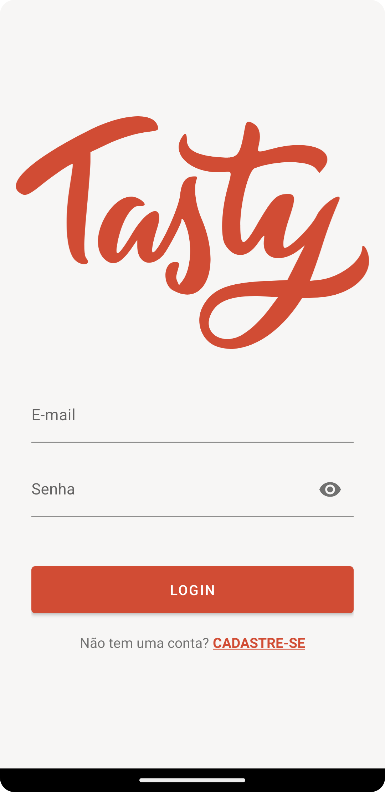
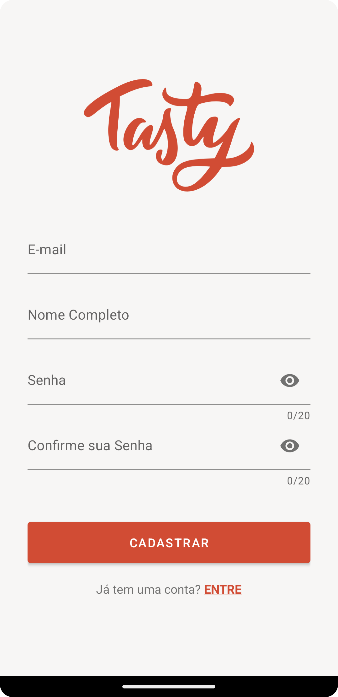
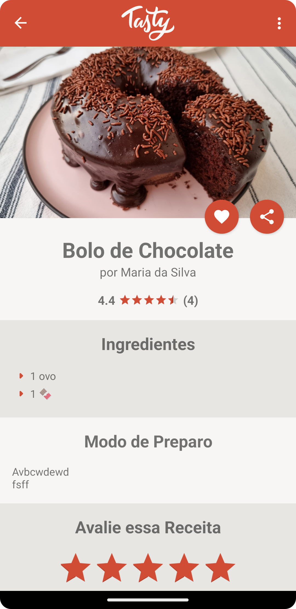
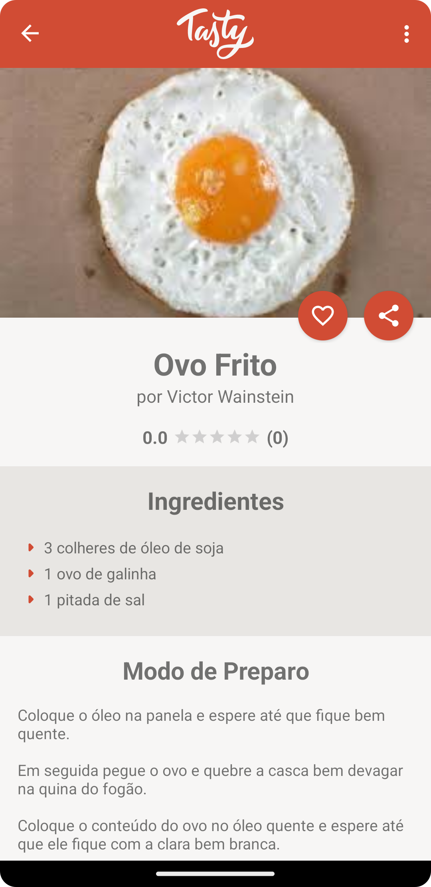
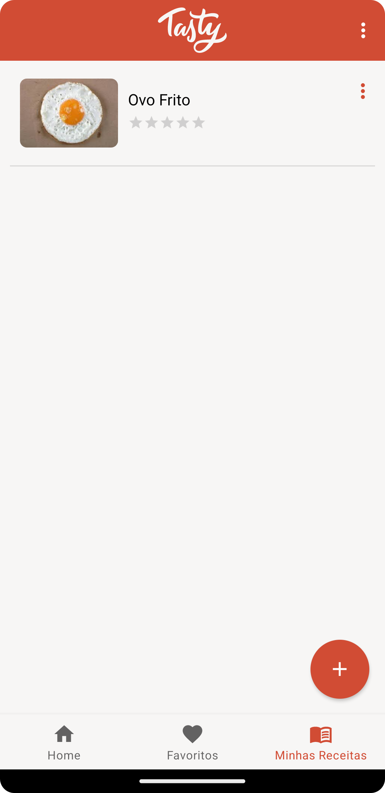
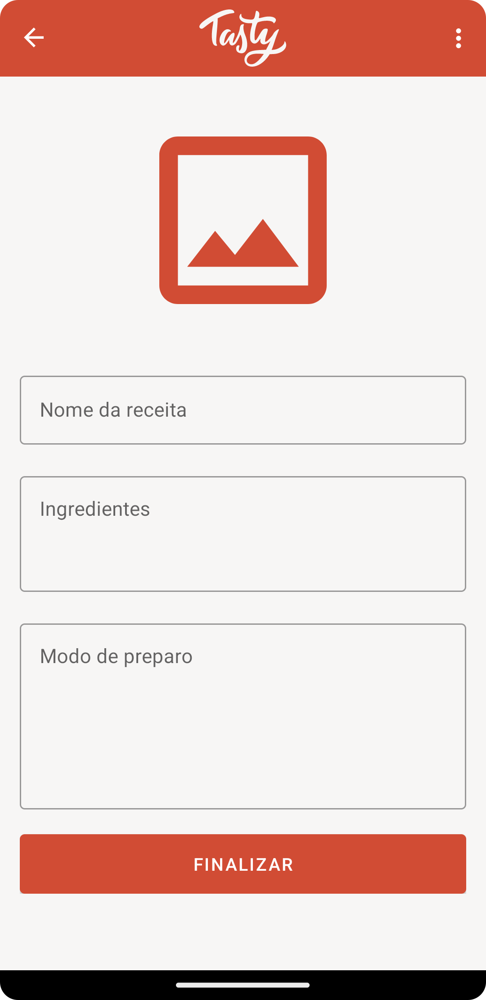
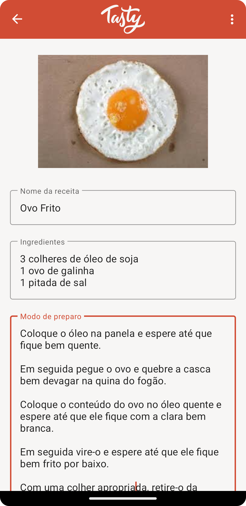
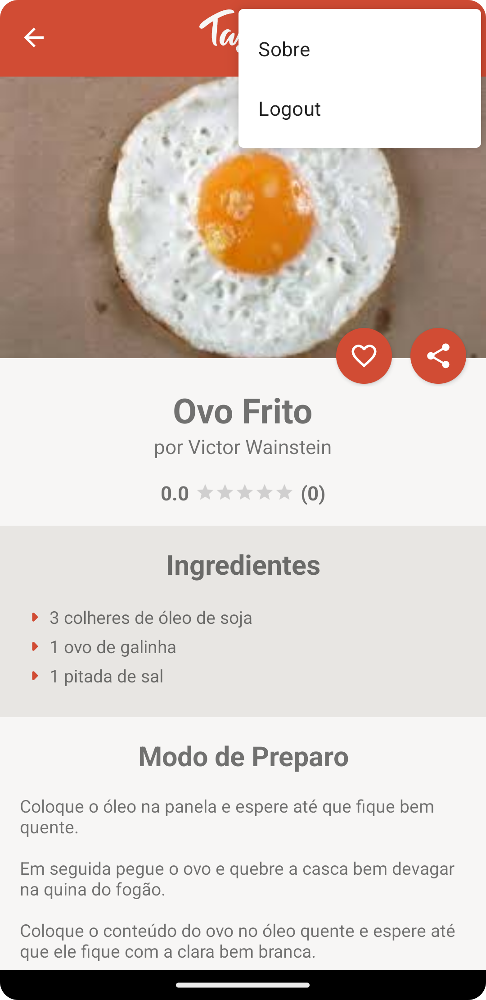
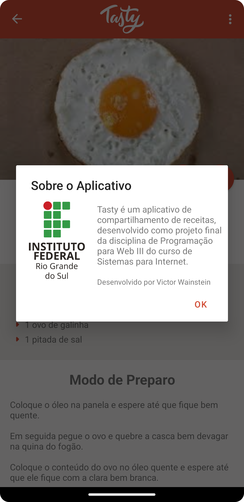

# Aplicativo de compartilhamento de receitas
Desenvolvido como projeto final da disciplina de Programação para Web III, o aplicativo permite aos usuários buscar por receitas, criar
suas próprias receitas e manter uma lista de receitas favoritas. As receitas podem ser pesquisadas por nome ou ingrediente, e os usuários
podem avaliar as receitas de outros usuários. O aplicativo foi desenvolvido no Android Studio, utilizando Java e Firebase.

## Telas

### Login e Cadastro
&nbsp;&nbsp;&nbsp;&nbsp; 

### Home e Busca
&nbsp;&nbsp;&nbsp;&nbsp; 

### Receita
&nbsp;&nbsp;&nbsp;&nbsp; 

### Favoritos

### Minhas Receitas
&nbsp;&nbsp;&nbsp;&nbsp; 

### Criar Receita
&nbsp;&nbsp;&nbsp;&nbsp; 

### Menu e Sobre
&nbsp;&nbsp;&nbsp;&nbsp; 

